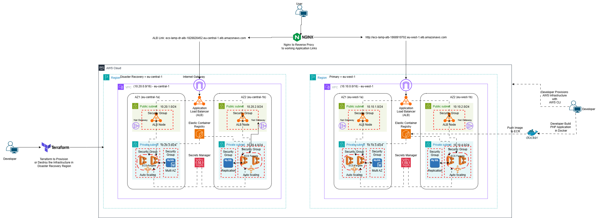

# AWS Infrastructure for Disaster Recovery (Terraform)

This project provisions a complete Disaster Recovery (DR) infrastructure for a LAMP stack web application using **Terraform** on **AWS**, including:

- ECS Fargate Cluster (DR)
- RDS MySQL Read Replica
- Application Load Balancer (ALB)
- VPC with public/private subnets, NAT gateways
- Lambda + EventBridge trigger for automatic failover

## 🚀 Architecture Overview

```
┌──────────────────────────────┐
│         Primary Region       │
│   - ECS Fargate              │
│   - RDS (MySQL)              │
│   - ALB                      │
└──────────────────────────────┘
           ⬇  EventBridge Trigger
┌──────────────────────────────┐
│     Disaster Recovery Region │
│   - ECS Cluster (Fargate)    │
│   - RDS Read Replica         │
│   - ALB                      │
└──────────────────────────────┘
```

## 🧱 Architecture



## 📦 Module Breakdown

- `network/`: VPC, subnets, IGW, NAT, routes
- `alb/`: Application Load Balancer and Target Group
- `ecs/`: ECS Cluster, Task Definitions, and Service
- `rds/`: MySQL Read Replica
- `dr_trigger/`: CloudWatch Alarm, EventBridge, and Lambda

## 🛠️ Prerequisites

- AWS CLI configured (`aws configure`)
- Terraform v1.3+
- AWS credentials with sufficient privileges

## ⚙️ Setup Instructions

1. **Clone the Repository**

```bash
git clone https://github.com/Zapwap123/AWS-Infrastructure-For-Disaster-Recovery-With-Terraform.git
cd AWS-Infrastructure-For-Disaster-Recovery-With-Terraform
```

2. **Configure Variables**
   Update `dr.tfvars` with your actual AWS resource ARNs, secret ARNs, ECR image URI, etc.

3. **Initialize Terraform**

```bash
terraform init
```

4. **Plan the Deployment**

```bash
terraform plan -var-file="dr.tfvars" -out=dr-plan.tfplan
```

5. **Apply the Deployment**

```bash
terraform apply "dr-plan.tfplan"
```

## ✅ Outputs

- `dr_alb_dns_name`: DR ALB DNS
- `dr_rds_endpoint`: RDS read replica endpoint
- `dr_ecs_cluster`: DR ECS Cluster ARN
- `dr_ecs_service_name`: DR ECS Service

## 📌 Notes

- This infrastructure is deployed in the `eu-central-1` region as DR.
- Make sure your secrets in Secrets Manager follow the expected naming scheme.
- The failover trigger is automatic based on unhealthy host metrics from primary ALB.

## 🙋‍♂️ Maintainer

Seth Anmawen — [github.com/Zapwap123](https://github.com/Zapwap123)
